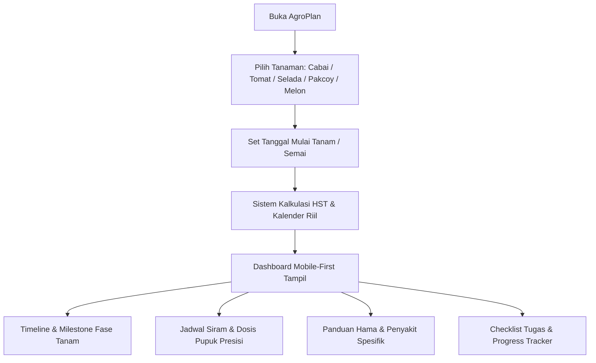

# 📅 AgroPlan: Generator Timeline & Tracker Budidaya Tanaman SV IPB

> **Aplikasi Web Asisten Budidaya Tanaman: Dari Benih hingga Panen, Lengkap dengan Jadwal Siram, Dosis Pupuk, dan Identifikasi Hama**  
> *Perspektif: Mahasiswa D4 Teknologi Produksi dan Pengembangan Masyarakat Pertanian (PPP) SV IPB*

---

## 1. Deskripsi Produk

### 1.1 Latar Belakang & Masalah
Mahasiswa pertanian dan pemula sering kali kesulitan mengelola waktu praktikum budidaya tanaman:
1. **Lupa Jadwal Pemupukan Kritis:** Pemupukan fase vegetatif dan generatif memiliki komposisi N-P-K yang berbeda; salah waktu dapat membuat tanaman gagal berbuah.
2. **Keteraturan Penyiraman:** Volume dan frekuensi air harus menyesuaikan umur tanaman (Hari Setelah Tanam / HST).
3. **Keterlambatan Deteksi Hama:** Hama seperti Thrips, Kutu Kebul, dan jamur Phytophthora sering terlambat diidentifikasi sebelum daun rusak total.
4. **Logbook Lapangan Berserak:** Mahasiswa butuh checklist harian dan rekap perkembangan tanaman untuk laporan praktikum.

### 1.2 Solusi
**AgroPlan** adalah asisten budidaya berbasis web responsif modern. Pengguna cukup memilih jenis tanaman dan tanggal mulai tanam. Sistem secara otomatis menghitung dan merancang:
* **Timeline Budidaya Dinamis:** Fase semai, pindah tanam, vegetatif, pembungaan, hingga panen dengan estimasi tanggal riil.
* **Jadwal Penyiraman & Kebutuhan Pupuk:** Dosis gram/liter, teknik aplikasi (kocor/semprot), dan frekuensi harian.
* **Deteksi & Pencegahan Hama:** Gejala dini dan resep Pengendalian Hama Terpadu (PHT) ramah lingkungan.
* **Interactive Progress Tracker:** Checklist kegiatan harian berbasis HST yang tersimpan otomatis di browser (`localStorage`).

---

## 2. Fitur Utama & Alur Pengguna (User Flow)



---

## 3. Spesifikasi Teknis

* **Desain:** Soft, warm, premium & modern (Warm White on Cream & Light Brown with Warm Terracotta/Orange Accents), mobile-first, soft to the eyes.
* **Ikon:** [Lucide Icons](https://lucide.dev) via CDN (`lucide.createIcons()`).
* **Styling:** Tailwind CSS via CDN.
* **Logika & Data:** Vanilla JavaScript (ES6+), kalkulator HST otomatis, dan persistensi sesi/tasks.
* **Autentikasi:** Supabase Auth (Email & Password + Email Confirmation/Verification).
* **Deployment:** Siap deploy ke Vercel.

### Struktur File:
```text
04-timeline-budidaya/
├── index.html           # Markup responsif mobile-first, dashboard & modal auth
├── app.js               # Database agronomi, kalkulator HST, task state
├── auth.js              # Supabase Auth engine (login, register, email confirmation)
├── supabase-config.js   # Konfigurasi Supabase Project URL & Anon Key
├── vercel.json          # Konfigurasi deployment Vercel
└── README.md            # Dokumentasi teknis proyek
```

### Konfigurasi Supabase Auth:
1. Buka [supabase-config.js](supabase-config.js)
2. Masukkan `url` dan `anonKey` dari Supabase Dashboard (**Project Settings > API**).
3. Pastikan di Supabase Dashboard (**Authentication > Providers > Email**):
   - **Confirm email** aktif (`ON`).
4. Pastikan di Supabase Dashboard (**Authentication > URL Configuration**):
   - **Site URL** dan **Redirect URLs** diarahkan ke domain Vercel Anda (misal `https://your-app.vercel.app/**`).

---

## 4. Pengembang / Creator
* **Nama Lengkap:** Hani Fransiska Setya Widodo
* **NIM:** J0417251055
* **Program Studi:** D4 Teknologi Produksi dan Pengembangan Masyarakat Pertanian (PPP)
* **Institusi:** Sekolah Vokasi, IPB University


